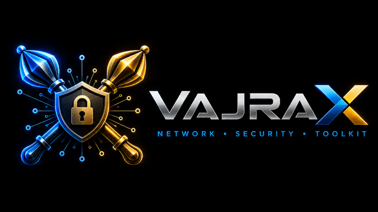

# VajraX
### Network • Security • Toolkit

**Professional-grade offline networking and cybersecurity toolkit for Android**

[⬇️ Download VajraX v2.0.0](https://github.com/VajraXcore/VajraX_Release_2.0/releases/latest/download/VajraX-v2.0.0.apk) | [🌐 Website](https://vajrax.in) | [📧 Contact](mailto:pbr65.tech@gmail.com)

---

## What is VajraX?

VajraX is a professional-grade, offline-first Android toolkit built for network engineers,
cybersecurity professionals, and CCNP/CCIE certification candidates.

Named after **Vajra (वज्र)** — the Sanskrit word for thunderbolt — VajraX delivers
precision, power, and reliability in every tool.

> "The last tool a network professional will ever need."

---

## 📱 Download

**[⬇️ Download VajraX v2.0.0 APK](https://github.com/VajraXcore/VajraX_Release_2.0/releases/latest/download/VajraX-v2.0.0.apk)**

Also available: [VajraX v1.0.0 (legacy)](https://github.com/VajraXcore/VajraX_Release/releases/latest/download/VajraX-v1.0.0.apk)

- **Version:** 2.0.0
- **Size:** 4.40 MB
- **Platform:** Android 8.0+ (API 26)
- **Target SDK:** 35
- **Root required:** No
- **Internet required:** Optional — needed only for 8 tools (SSH Terminal, SNMP Browser Pro, WiFi Analyzer Pro, Network Scanner Pro, Speed Test, Wake-on-LAN Pro, Advanced Ping & Reachability Probe, DNS Lookup)
- **Signing:** Signed with RSA-4096, APK Signature Scheme v2

**How to install:**
1. Download the APK
2. Enable "Install unknown apps" in Android Settings → Security
3. Open the downloaded APK and tap Install
4. Done — VajraX is ready to use

---

## ✨ Features

### 68 Tools — 5 New Engines (v2.0) + 31 Foundation Tools (v1.0)

**🕸️ FABRIC ARCHITECT** (9 tools)
VXLAN MTU Calculator, TCP Window Scaling Modeler, AWS/Azure CIDR Carver, Route-Target & RD Planner, EVPN-VXLAN Fabric Designer, Spine-Leaf Underlay Designer, BGP Path Analyzer Pro, SD-WAN Policy Calculator, WireGuard Config Generator

**📊 CONFIG INTELLIGENCE** (6 tools)
Config Analyzer, Config Template Engine, Multi-Vendor Translator Pro, Config Vault (AES-256-GCM encrypted), Regex Filter Engine, Config Diff Pro

**🛡️ SECURITY OPS CENTER** (9 tools)
Zero Trust Architecture Planner Pro, Firewall Policy Analyzer, CVE Explorer Pro, Log Parser & Analyzer, IP Reputation & Threat Intel, Certificate Chain Analyzer Pro, Compliance Auditor Pro, WPA3/WPA2 PMK Calculator, DNSSEC Chain Validator

**📶 LIVE NETWORK OPS** (7 live tools)
SSH Terminal, SNMP Browser Pro, WiFi Analyzer Pro, Network Scanner Pro, Speed Test, Wake-on-LAN Pro, Advanced Ping & Reachability Probe

**📡 PROTOCOL DEEP DIVE** (6 tools)
Protocol Lab Pro, RFC Browser, Multi-Vendor Command Reference Pro, Encoder Toolkit, Bitsmith Sandbox, Hex Packet Decoder

**🏗️ ARCHITECT** (14 tools, v1.0 foundation)
VLSM Planner, Subnet Hub, Subnet Troubleshooter, Network ID Architect, Route Summarizer, IPv6 Suite, IP Converter, CIDR Cheat Sheet, Binary Heart, Reverse VLSM, MTU/MSS Planner, Bandwidth Calculator, ACL Generator, IPv6 PD Planner

**⚙️ AUTOMATE** (2 tools, v1.0 foundation)
Universal Translator, Protocol Lab

**🛠️ ARMORY** (5 tools, v1.0 foundation)
Cable Wiring Guide, MAC OUI Lookup, Port Reference, Field Options, Protocol Cheat Sheet

**⌨️ COMMAND** (2 tools, v1.0 foundation)
DNS Lookup, Hash Generator

**📊 SOLUTIONS** (8 tools, v1.0 foundation)
IP Camera Planner, CCTV Storage Calculator, PoE Budget Planner, Fiber Power Budget, VLAN Architect, Compliance Checker (PCI-DSS, NIST, ISO 27001), Zero Trust Validator (NIST SP 800-207), Redundancy Planner (HSRP/VRRP)

All 31 v1.0 tools were upgraded with 6-layer output and dual HTML/PDF export in v2.0. Five original v1.0 tools (Tactical Manual, Network Scanner, Ping & Reachability Probe, SSL Inspector, Config Diff) were superseded by their Pro replacements above.

---

## 🔒 Privacy

VajraX is built on a zero-trust privacy model:

- ✅ **Zero telemetry** — no usage data collected
- ✅ **Zero analytics** — no tracking of any kind
- ✅ **Zero ads** — no advertising SDKs
- ✅ **Zero cloud sync** — nothing leaves your device
- ✅ **No account required** — install and use immediately
- ✅ **Minimal permissions** — only INTERNET + ACCESS_NETWORK_STATE
  (required for 8 tools: SSH Terminal, SNMP Browser Pro, WiFi Analyzer Pro, Network Scanner Pro, Speed Test, Wake-on-LAN Pro, Advanced Ping & Reachability Probe, DNS Lookup)

What you calculate in VajraX stays in VajraX.

---

## 📋 Requirements

| Requirement | Details |
|---|---|
| Android Version | 8.0+ (API 26) |
| Target SDK | 35 |
| Storage | 4.40 MB |
| Root | Not required |
| Internet | Optional — 60 of 68 tools are 100% offline |
| Permissions | INTERNET, ACCESS_NETWORK_STATE only |

---

## 🗺️ Roadmap

| Version | Status | Highlights |
|---|---|---|
| v1.0.0 | ✅ Released (June 2026) | Foundation Release, 31 tools |
| v2.0.0 | ✅ Current (July 2026) | 5 new engines, 68 tools, 6-layer output, dual export |
| v2.1.0 | 🔄 Upcoming | Windows version (C# + WinUI 3) |

---

## 📞 Contact

- **Website:** [vajrax.in](https://vajrax.in)
- **Email:** [pbr65.tech@gmail.com](mailto:pbr65.tech@gmail.com)
- **Bug Reports:** [pbr65.tech@gmail.com](mailto:pbr65.tech@gmail.com)
- **Feature Requests:** [pbr65.tech@gmail.com](mailto:pbr65.tech@gmail.com)

---

## ⚖️ Legal

**Copyright © 2026 VajraXcore. All rights reserved.**

VajraX is proprietary software, provided free of charge for personal
and professional use. Not affiliated with, endorsed by, or associated
with Cisco Systems, Juniper Networks, or any other vendor or organization.

All product names, logos, and brands mentioned are property of
their respective owners.

Redistribution of the APK without permission is prohibited.

See [Privacy Policy](https://vajrax.in#privacy) for full details.

---

**VajraX — Network • Security • Toolkit**

[vajrax.in](https://vajrax.in) | [pbr65.tech@gmail.com](mailto:pbr65.tech@gmail.com)

